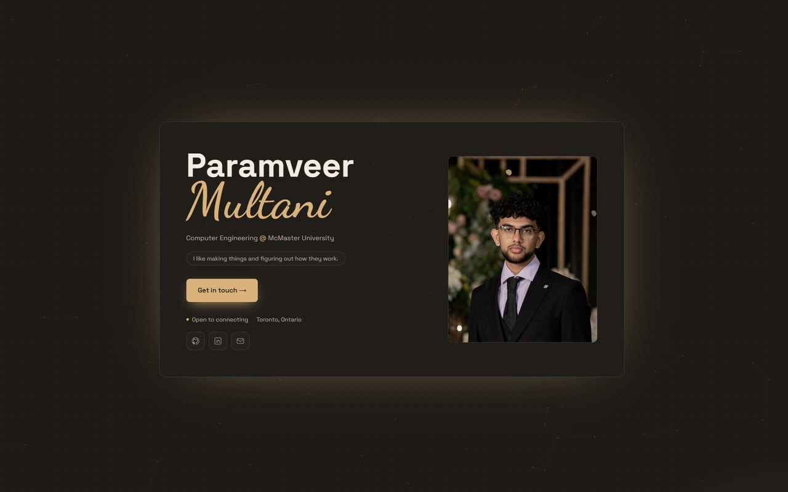

# Paramveer Multani — portfolio



A one page personal site for a Computer Engineering co-op student at McMaster. Everything on
it — roles, education, projects, skills, hobbies — is read from a single typed content file,
so adding a job or a project is a data change, not a layout change.

**Live:** _not deployed yet_

## Stack

- **Next.js 16** (App Router) with **TypeScript** in strict mode
- **Tailwind CSS v4**, themed with CSS custom properties rather than a config palette
- **next/font** for self hosted Space Grotesk, JetBrains Mono and Dancing Script
- **Vitest** + Testing Library + vitest-axe

No UI framework and no component library. The only runtime dependency beyond React and Next is
`framer-motion`.

## Running it

```bash
nvm use          # Node 22+, pinned in .nvmrc
npm install
npm run dev      # http://localhost:3000
```

| Script              | Does             |
| ------------------- | ---------------- |
| `npm run dev`       | dev server       |
| `npm run build`     | production build |
| `npm run typecheck` | `tsc --noEmit`   |
| `npm run lint`      | eslint           |
| `npm run test`      | vitest, once     |
| `npm run format`    | prettier, writes |

## How it is put together

```
app/
  layout.tsx      fonts, metadata, pre paint theme script, nav + footer
  page.tsx        the one route, composes every section
  globals.css     palettes, keyframes, reduced motion
  icon.svg        favicon
components/       one file per section, plus shared bits
content/site.ts   every piece of copy and every image path
public/           photos, logos, project shots, resume
```

**To change what the site says, edit `content/site.ts`.** It is the single source of truth and
is typed, so a missing field fails `npm run typecheck` rather than rendering blank.

Images go in `public/` and are referenced from `site.ts` by absolute path. Hobby photos live in
`public/journey/<hobby>/`, project shots in `public/projects/`.

## Theming

Two palettes are defined as CSS variables in `app/globals.css`: the light one on `:root`, the
dark one under both `prefers-color-scheme: dark` and `[data-theme="dark"]`, so an explicit
toggle beats the OS. A small inline script in `layout.tsx` applies a saved choice before first
paint, which is why there is no flash of the wrong theme.

Muted text is held at a measured 4.5:1 contrast minimum against every surface, in both themes.
If you change `--muted`, re-check it.

## Motion

All animation is CSS transitions plus one `IntersectionObserver` hook (`hooks/useReveal.ts`).
A global `prefers-reduced-motion` rule collapses every animation and transition to nothing, so
new effects get that behaviour for free. The hero canvas stops animating once it scrolls out of
view.

## Deploying

Built for Vercel with the default Next config. Security headers are set in `vercel.json`.
Before the first deploy, set `siteUrl` in `content/site.ts` to the real origin — canonical
URLs, Open Graph tags, the sitemap and `robots.txt` all derive from it.
